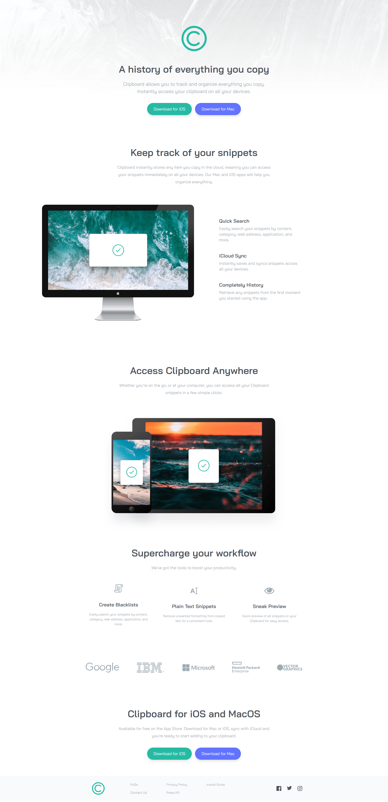
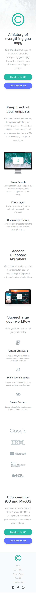

# Clipboard Landing Page <!-- omit in toc -->

Challenge from [Frontend Mentor](https://www.frontendmentor.io/)

## Table of Contents <!-- omit in toc -->

- [About](#about)
- [Challenge Description](#challenge-description)
- [Technologies Used](#technologies-used)
- [Authors](#authors)
- [Challenge](#challenge)
- [Screenshots](#screenshots)
- [Related Projects](#related-projects)

## About

The purpose of this project was to used design files to create a webpage using HTML5 and TailwindCSS. The webpage were designed with Desktop and Mobile design.

## Challenge Description

"Put your layout skills to the test with this HTML & CSS landing page challenge. This challenge includes a design for hover states."

## Technologies Used

## Authors

- [@haylzrandom - GitHub](https://www.github.com/haylzrandom)
- [@haylzrandom - Frontend Mentor](https://www.frontendmentor.io/profile/HaylzRandom)

## Challenge

- [Clipboard Landing Page](https://www.frontendmentor.io/challenges/clipboard-landing-page-5cc9bccd6c4c91111378ecb9)

## Screenshots

    <table>
        <thead>Desktop</thead>
        <tr>
            <td>
                
            </td>
        </tr>
    </table>

    <table>
        <thead>Mobile</thead>
        <tr>
            <td>
                
            </td>
        </tr>
    </table>

## Related Projects

Here are some other challenges I have completed from Frontend Mentor

- [REST Countries API with Colour Theme Switcher](https://github.com/HaylzRandom/rest-countries-api)
- [Space Tourism Multipage Website](https://github.com/HaylzRandom/space-tourism-multipage-website)
- [Calculator App](https://github.com/HaylzRandom/calculator-app)
- [Advice Generator App](https://github.com/HaylzRandom/advice-generator-app)
- [Testimonials Grid Section](https://github.com/HaylzRandom/testimonials-grid-section)
